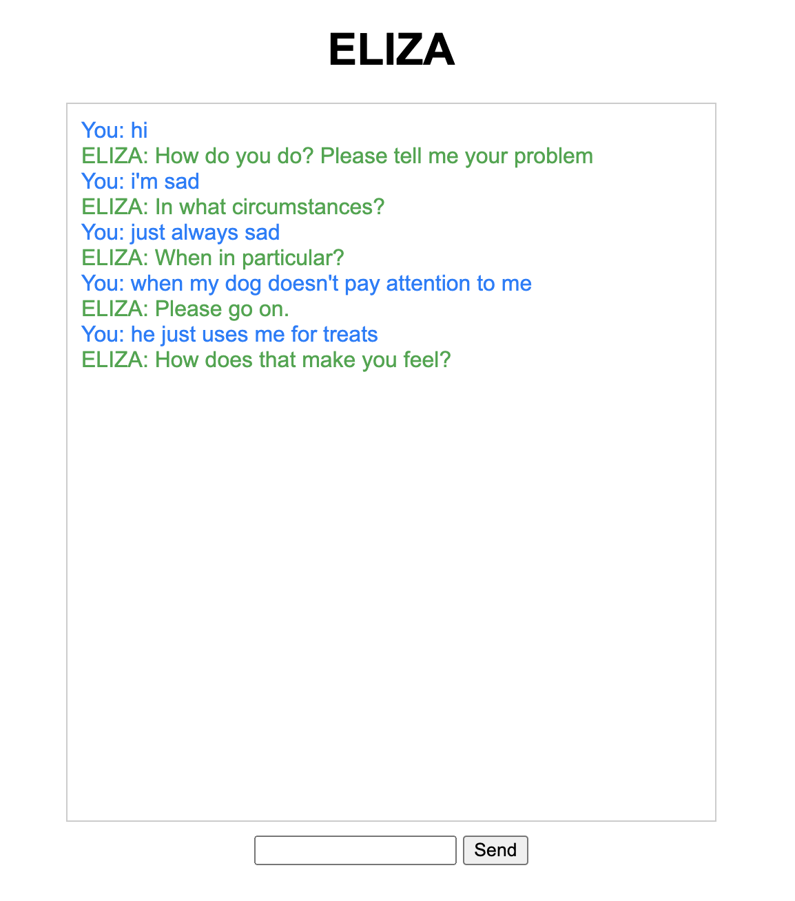

# ELIZA
A version of ELIZA, a Rogerian psychotherapist chatbot

## About ELIZA

* From Jurafsky and Martin's textbook on speech and natural processing: *

Eliza is an early natural language processing system that could carry on a limited conversation with a user by imitating the responses of a Rogerian psychotherapist (client-centered therapy). ELIZA is a surprisingly simple program that users pattern matching to recognize phrases like "I need X" and translate them into suitable outputs like "What would it mean to you if you got X?". This simple technique succeeds in this domain because ELIZA doesn't actually need to know anything to mimic a Rogerian psychotherapist. As Weizenbaum notes, this is one of the few dialogue genres where listeners can act as if they know nothing of the world. ELIZA's mimicry of human conversation was remarkably successful: many people who interacted with ELIZA came to believe that it really understood them and their problems, many continued to believe in ELIZA's abilities even after the program's operation was explained to them.

My script is tailored from [iagoleal/eliza](https://github.com/iagoleal/eliza/blob/master/scripts/doctor.json#L114)

## Skills

- HTML, CSS, JS
- Python, Flask
- Regex/pattern matching

## Steps to run

- python app.py
- http://127.0.0.1:5000